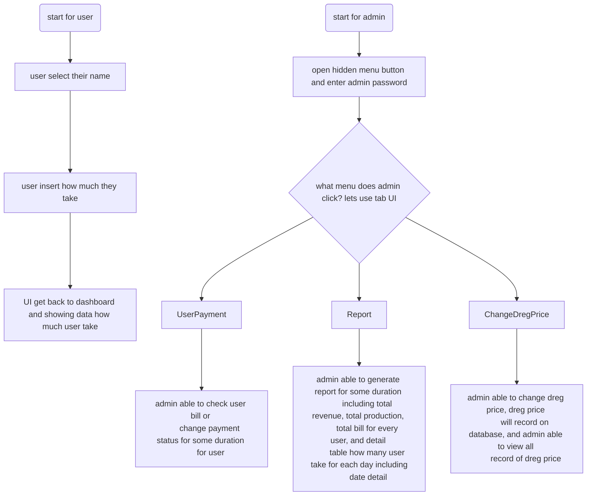
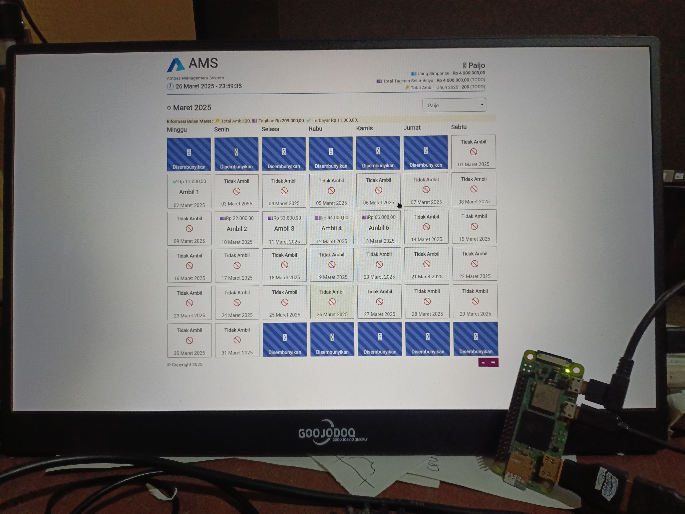
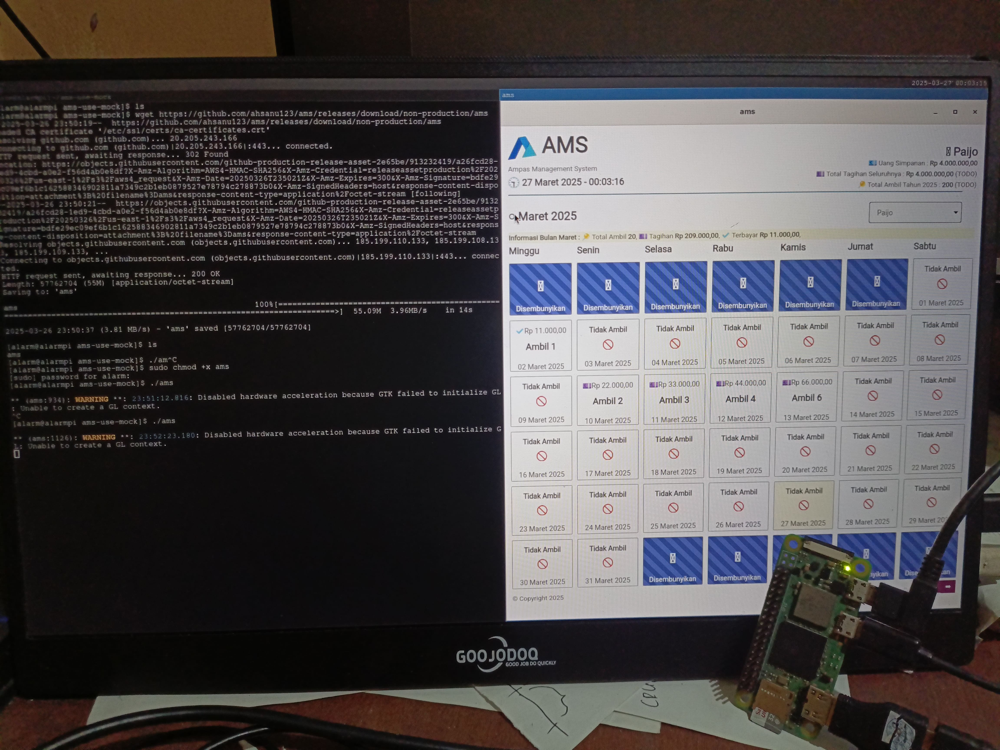

  
  
  
  

 
  
# 🥔 Introduction
Ampas Management System (AMS) is a personal project designed to streamline and manage the selling process of soybean dregs (ampas). It simplifies daily operations by providing an efficient way to track sales and manage records.

AMS is a desktop application built with Tauri, leveraging its lightweight, secure, and cross-platform capabilities for an optimal native experience. The frontend is developed using React Router v7 as a framework, utilizing its modern routing and data APIs for a clean, maintainable client-side architecture—without the complexity of server-side rendering (SSR).

On the backend, AMS uses:

- 🚒 Diesel, a type-safe and efficient query builder for Rust.
- 🐟 Sea-query, providing flexible and easy-to-manage database migrations.
- 🩹 React Router V7, modern routing with Suspense Feature.

The goal of AMS is to deliver a simple, fast, and reliable system tailored for personal use in managing the daily sales operations of soybean dregs.

## 🌳 Project Log

  
Expand Me!!!

### 🎻 Current UI to Remind

  
- 21 Januari 2025, running browser on raspberry pi zero 2 was to slow, even you don't start dotnet backend yet. after searching tauri seem solve this, but with consequence changing backend into tauri (rust).
- 24 Februari 2025, 👷‍♂️ TODO create diesel migration and sea-query table builder combination, create macro to automate sea-query table function creation from struct model
- 25 Februari 2025, turn out diesel was sync (because its made before async in rust), for current case its ok to use sync.
- 8 Maret 2025, Create Basic structure of CRUD with Rust in ProductRepository
- 27 maret 2025, first trying on real raspberry pi zero 2w device, app is fast enough (compared to aspnet core and spa combination 😄), but authentication cookie still not work now, i think its because tauri permision, need reading more about it in their docs 
- ✔️ TODO: Implement DatabaseMetadata function with diesel.
- 🌳 TODO: create list of needed command for ui
- 🌳 TODO: create list of response name model for ui
- 🌳 TODO: create UI mockup
- 🌳 TODO: create needed query for command
- 🌳 TODO: create list logic for UI
- ✔️ TODO: add mobx -> Nope use Zustand instead
- ✔️ TODO: create password hashing with argon and save to db
- 🌳 TODO: create Dockerfile and documentation about cross compile for archlinuxarm in [CrossCompile](./docs/cross_compile.md)

## 🎏 Useful Notes 

- running cargo test -> `cargo test test_insert_product -- --nocapture`
- get expanded macro for debugging -> `cargo expand --lib  model::product`
- react router Revalidate for refetching data and route
- usestate with zustand to update ui only
- to run vitest with ui and watch mode `yarn test --ui --watch`
- make binary runable -> `sudo chmod +x binaryName`
 
## ⚓ Reference 

- [Introducing the Identity API endpoints](https://andrewlock.net/exploring-the-dotnet-8-preview-introducing-the-identity-api-endpoints/)
- [ASP.NET Core Identity Github Folder](https://github.com/dotnet/aspnetcore/tree/main/src/Identity)
- [ASP.NET Core Identity Default Flow Implementation with Page](https://github.com/dotnet/aspnetcore/blob/main/src/Identity/UI/src/Areas/Identity/Pages/V5/Account/ExternalLogin.cshtml.cs)

 Work In Progress, Made With ❤️ By Ah...
