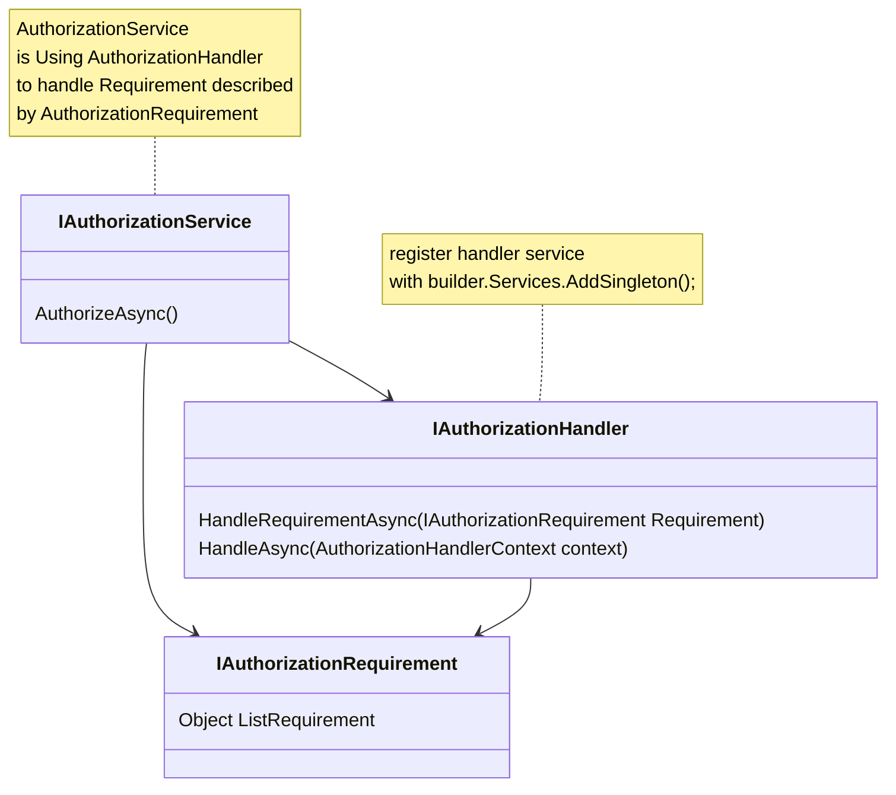

# 💩 Introduction

AMS - Ampas Management System is personal project for **personal use** for managing ampas selling.

## 🧻 Personal Note 

  
Expand

 
## ⚓ Reference 

- [Introducing the Identity API endpoints](https://andrewlock.net/exploring-the-dotnet-8-preview-introducing-the-identity-api-endpoints/)
- [ASP.NET Core Identity Github Folder](https://github.com/dotnet/aspnetcore/tree/main/src/Identity)
- [ASP.NET Core Identity Default Flow Implementation with Page](https://github.com/dotnet/aspnetcore/blob/main/src/Identity/UI/src/Areas/Identity/Pages/V5/Account/ExternalLogin.cshtml.cs)

 Work In Progress, Made With ❤️ By Ah...
